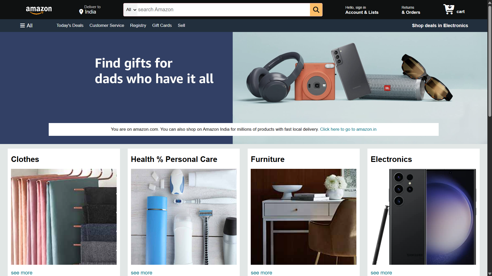

# 🛒 Amazon Clone Website

An **Amazon Clone** built using **HTML, CSS, and JavaScript** to replicate the basic UI and layout of the Amazon e-commerce platform.  
This project is created for learning and practicing **frontend web development** skills.

---

##  Features
- Amazon-like homepage layout
- Header with logo, search bar, and navigation
- Product cards with images and pricing
- Footer section similar to Amazon

---

##  Technologies Used
- **HTML** – Page structure  
- **CSS** – Styling and layout  

---

## 📂 Project Structure
```
   amazon_clone/
   │── amazon_logo.png
   │── box1_image.jpg
   │── box2_image.jpg
   │── box3_image.jpg
   │── box4_image.jpg
   │── box5_image.jpg
   │── box6_image.jpg
   │── box7_image.jpg
   │── box8_image.jpg
   │── hero_image.jpg
   │── index.html
   │── style.css
   │── README.md
```

---

## 📸 UI Preview


---

## 👤 Author
**Chirag Gupta**

---

⭐ If you like this project, give it a star on GitHub!
